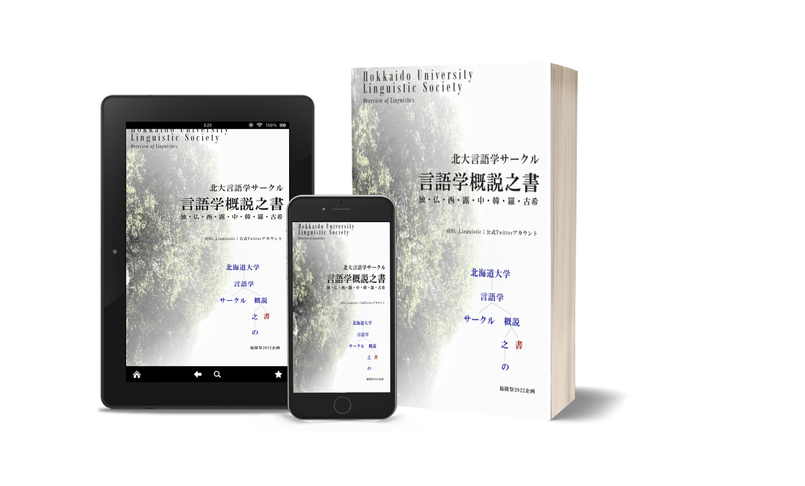

※画像はイメージです

## 『言語学概説之書』 楡陵祭2022

| 媒体 | 場所 | 状況 |
| :-: | :-: | :-: |
| 紙 | 楡陵祭2022 教養棟 E305 | 終了 |
| PDF | [Google Drive](https://drive.google.com/file/d/1eSBjcDgiVpzU9Z1cMRmturJrNpDrx9_G) | 頒布中 |

### 概要

北大の第二外国語として選択可能な,
ドイツ語・フランス語・スペイン語・ロシア語・中国語・韓国語,
そして外国語演習科目として選択可能な言語のうち
ラテン語・古典ギリシア語をあわせた 8 言語の簡単な解説を目的としたもので,
文法面 (形態論・統語論的) での解説を主としております.
言語学にはあまり興味を抱かなかった,
あるいは言語学の知識はそれほどない,
という読者でも読めるように平易な解説につとめております
(したがって「言語学」というよりはむしろ「語学」に近くなっているかと思います).
北大に興味がある高校生や在学している大学生,
また近隣住民の方など様々な方が楡陵祭に来場されるかと思いますが,
どなたでも楽しめるような冊子にするよう心掛けました.

※「はじめに」より抜粋

::: details 目次

1. はじめに
1. 目次
1. 文法用語解説
1. 世界人権宣言第一条の訳
1. 各言語解説
    1. ドイツ語 / Deutsch
    1. フランス語 / Français
    1. スペイン語/ Español
    1. ロシア語/ Русский
    1. 中国語 / 汉语 (普通话)
    1. 韓国朝鮮語 / 한국어
    1. ラテン語 / Latina
    1. 古典ギリシア語 / Ἑλληνική

:::
